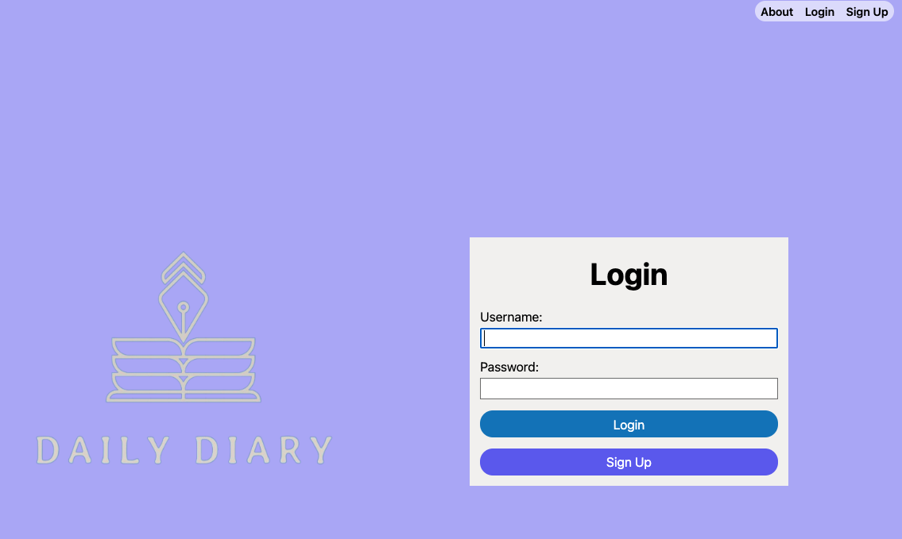
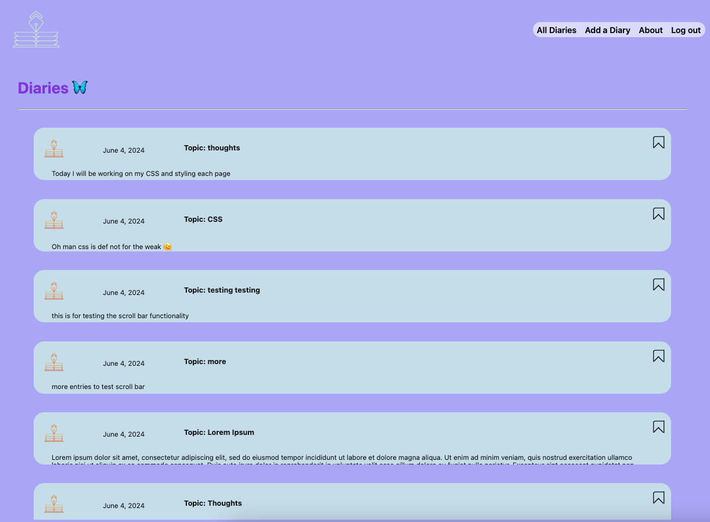

# Daily Diary 🦋

*** 
### `Description:`
##### 
Introducing Daily Diary App – your personal space for capturing life's moments, thoughts, and reflections. Whether you're chronicling your daily activities, setting personal goals, or simply jotting down spontaneous ideas, our app offers a user-friendly and secure platform to document every detail. Seamlessly login to your devices and ensure your diaries are always at your fingertips. Start your journey of self-discovery and mindful living with the Daily Diary App – where every day is worth remembering.

***

# [Use Daily Diary](https://daily-diary-kb.fly.dev/) 
***

### `Technologies`
***

|Fly.io   |Whimsical  | Trello
|:-------:| -----:|-- |

***
### `Trello`
***
* Trello planning materials [here](https://trello.com/b/4wRhwbE5/daily-diary-%F0%9F%A6%8B)
***

### `Credits 🙌`
***
* Check out all my [Attributions](https://docs.google.com/document/d/16E9jMZazlJsAVt73zyv63EO5j3Y5WJF1xETt3l5MJAs/edit)

***
### `Ice Box🧊`
*** 
- [] AAU, I should be able to bookmark some of my notes to easily find them.
- [] AAU, I want to be able to add attachments along with my dairies.
- [] AAU, I should be able to voice record my diary when I do not feel like typing it out.
- [] AAU, I should be able to search for a diary entry.
- [] AAU I would to see hamburger button when using Daily Diary on my phone.